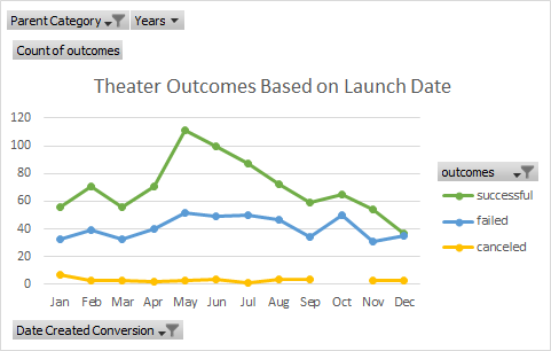
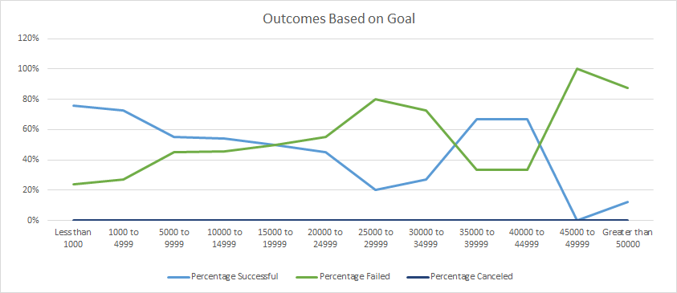

# Kickstarting with Excel

## Overview of Project
   The analysis of Louise's gathered data on Kickstarter campaigns provides the background on learning how to navigate large clusters of data through Excel. The basis of understanding the analysis of the data within Excel will prove as a foundation for many other data analysis projects to come.
### Purpose
   The purpose of this analysis that I have gleamed is to familiarize myself to the ins and outs of navigating Excel. It provides a basic understanding on the specificity that code is in what it can do when implemented correctly or incorrectly as well as how to use the program to find and organize information needed for analysis. It also provides a lens for how to interpret the data given to make certain decisions and predictions in relation to the proposed project.

   From the point of view for Louise, this data collected can give a good perspective of when to launch her own kickstarter as well as what projects based on genre/form of performance does well in other instances. 
## Analysis and Challenges
   

   
### Analysis of Outcomes Based on Launch Date

### Analysis of Outcomes Based on Goals

### Challenges and Difficulties Encountered

## Results

- What are two conclusions you can draw about the Outcomes based on Launch Date?

- What can you conclude about the Outcomes based on Goals?

- What are some limitations of this dataset?

- What are some other possible tables and/or graphs that we could create?
