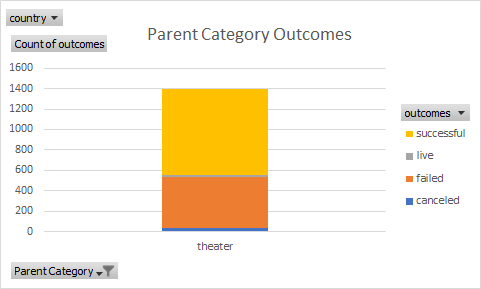
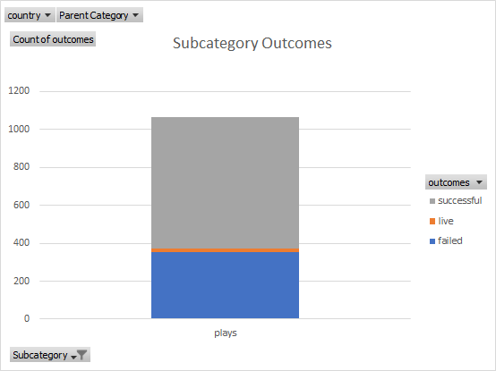
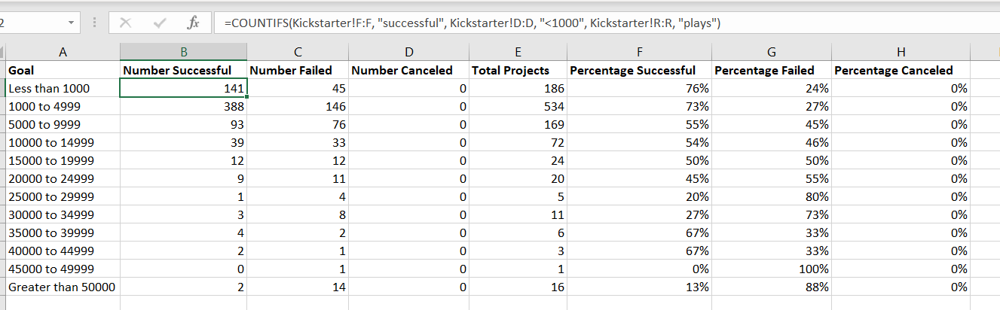

# Kickstarting with Excel

## Overview of Project

   The analysis of Louise's gathered data on Kickstarter campaigns provides the background on learning how to navigate large clusters of data through Excel. The basis of understanding the analysis of the data within Excel will prove as a foundation for many other data analysis projects to come.

### Purpose

   The purpose of this analysis that I have gleamed is to familiarize myself to the ins and outs of navigating Excel. It provides a basic understanding on the specificity that code is in what it can do when implemented correctly or incorrectly as well as how to use the program to find and organize information needed for analysis. It also provides a lens for how to interpret the data given to make certain decisions and predictions in relation to the proposed project.

   From the point of view for Louise, this data collected can give a good perspective of when to launch her own kickstarter as well as what projects based on genre/form of performance does well in other instances. 

## Analysis and Challenges

    From the data sorted and organized, my findings for Louise were that when, how large of a goal, as well as the type of the kickstarter has an affect on how probable success of the project launched will be.

    Considering Louise's decision on starting a camapign for a theater play, the odds of success are slightly in favor of _theaters_ with less than half being either failed or canceled, and this positive trend continues with _plays_ within the theater category being more successful than not.

    In conjunction with a planned starting date in the month of **May** and financial goals within the **ranges of less than $5000** or **$35000 to $45000**, the probability of reaching the stated goal has a more positive outlook than other possibilities in launch date and goals.

    
### Analysis of Outcomes Based on Launch Date
 
   The month where the most successful campaigns for theater are launched being in May with a downward trend to September with November, December, and January being the lowest successfull campaigns for funding. If Louise would like to improve her chances, the end of US Spring leading to the beginning of Autumn are the best times to launch. However, this isn't the only trend found among the data.
   

### Analysis of Outcomes Based on Goals

   The financial goal of the campaign is also a large contributor in the probability of success. As smaller financial goals result in a higher chance of success, as well as projects in theater plays ranging from $35000 to $45000 acheiving higher success rates. There is a notable valley from $5000 to $35000 where there is a dip in how successful the campaigns are and a large drop after $45000. These ranges would be the ones Louise should avoid when proposing a goal.
   

### Challenges and Difficulties Encountered

    Some challenges I encountered in following the directions to sort the data were mostly down to how specific the formula coding was to get what I wanted. One of the mistakes I made involved the line graph for Outcomes Based on Goals being incorrect due to my fault in not narrowing the data to include only _plays_. 

    The amount of specificity involved in getting the correct data falls in line with the prospect of having to tell the computer **_exactly_** what needs to be done, otherwise the result will not be correct. The redundancy of checking the codes to make sure the correct columns/rows/cells also played a part in data combing. It's a mindset, that as a human being with many automatic functions, such as moving my arms without thinking about which specific muscles to use, is difficult to adjust to but necessary in coding in general.

## Results

- What are two conclusions you can draw about the Outcomes based on Launch Date?
    
    **May** is the clear most successful month to launch a campaign with a downward trend to September, where November, December, and January are some of the worst times to launch with much lower success in reaching their goals.

- What can you conclude about the Outcomes based on Goals?

    Projects with less than $5000 or $35000 to $45000 being the most successful goal ranges while a noticeable valley in between $5000 and $35000 closer to 50% or lower success rates appears. These two budget ranges are the ones Louise should aim for.

- What are some limitations of this dataset?
    
    Some limitations I noted would be for the certain genres of the plays as well as target audiences. Certain genres perform better than others in other forms of media, and seeing what labeled genres made it or didn't make it could help inform budgets and public interest. More specific locations or regions could also improve the data, along with how the kickstarters are advertised. Advertising tactics and platforms can see which ones do better as well.

- What are some other possible tables and/or graphs that we could create?

    The deadline was an unused column of data that could have a significant impact on the success of a campaign. Shorter deadlines are under more pressure to perform better per day than longer ones.

    Spotlight and Staff picks also fall in that line of how much exposure can improve its success.